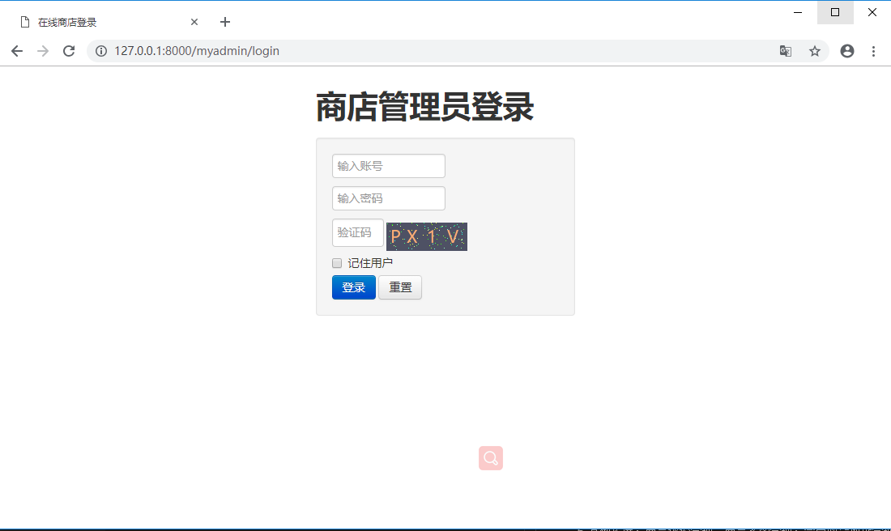
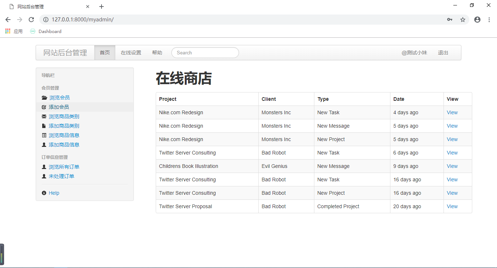

# 在线商城

本项目基于Django框架仿制魅族商城，如有不当，请告知;

## 效果预览

### 后台登录

### 后台会员信息浏览

## 项目结构

本商城项目分为网站前台和网站后台管理两部分：

### 网站前台

1. 网站首页商品展示：推荐商品，分类展示部分商品，热卖商品，新商品等展示;
2. 商品列表页：分页展示某类别或指定条件（搜索）的部分商品列表信息。
3. 商品详情页：通过商品ID号来展示指定商品详情信息。
4. 购物车管理：添加、查看、删除、清空等自己的购物信息。
5. 会员模块：注册，登录、退出以及进入会员中心。
6. 会员中心：个人信息管理、我的订单信息。
7. 订单处理。
8. 其他扩展：商品评论、商品多图；会员收货地址管理，商品收藏；首页轮播图；站内公告、新闻；友情链接；

### 网站后台

1. 后台操作：登录、退出.
2. 会员信息管理：查看、修改会员状态、重置密码.
3. 商品类别信息管理：添加、删除、修改、查看商品类别信息.
4. 商品信息管理：添加、删除、修改、查看.
5. 订单信息管理：查看订单、订单详情、处理订单.
6. 其他扩展：商品评论管理、商品多图管理；会员收货地址管理，商品收藏；首页轮播图管理；站内公告、新闻管理；友情链接管理.